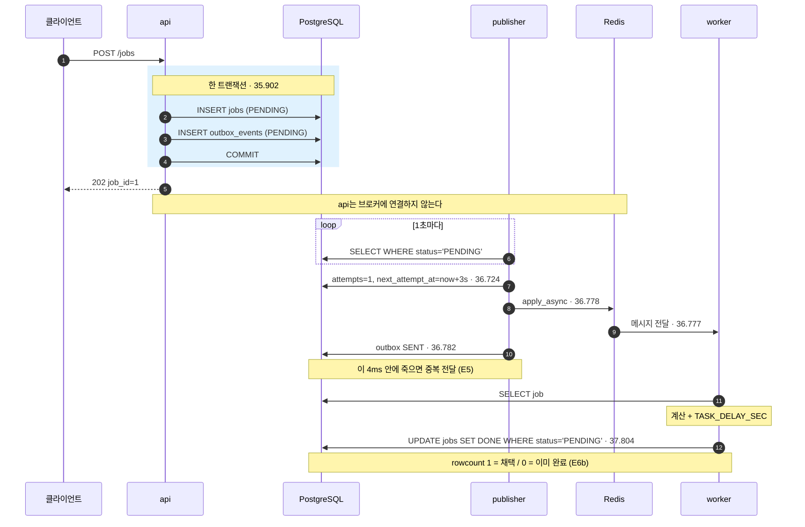
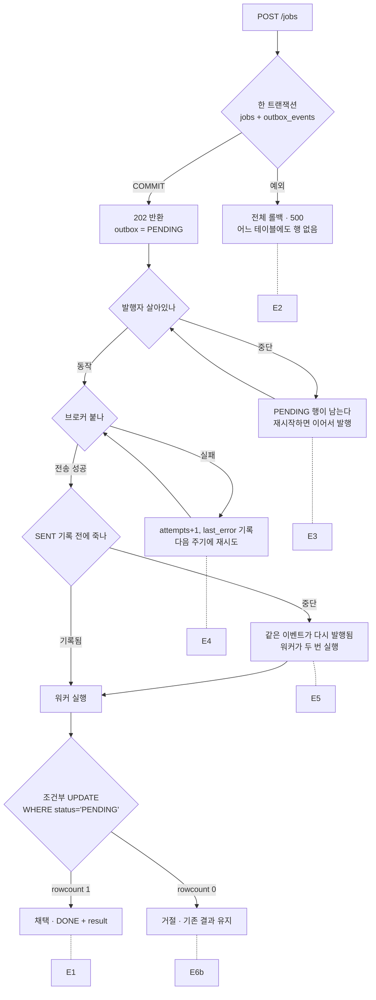
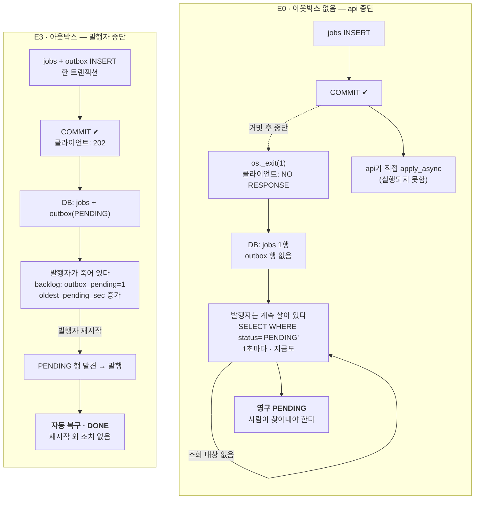

# retro-msg-queue — 트랜잭셔널 아웃박스 학습 MVP

과거 보험 프로젝트에서 "가입은 커밋됐는데 증권 태스크가 큐에 등록되지 않았고, 그것을 탐지할 근거조차 없었다"는 지점을 손으로 재현·개선하는 학습 프로젝트다. 서비스가 아니다.

- 설계·결정: [`dev-plan.md`](dev-plan.md) (v3)
- 진행 상태: [`roadmap.md`](roadmap.md)
- 과거 프로젝트 정리: `insurance_message_queue_interview_notes_2026-09-16.md` (개인 자료, git 미추적)

**로컬 아웃박스 MVP 완료 (1~4단계).** 실험 9개 전부 실행하고 리포트를 남겼다. SQS(5단계)는 미실행.

---

## 구조

### 정상 흐름 (E1 실측 타임스탬프)

아래 시각은 `reports/E1-20260920-1.md`의 실제 로그에서 가져온 것이다. 접수부터 완료까지 1.9초.



### 실패 지점과 실험의 대응

각 분기점이 실험 하나에 대응한다.



### E0 대조군 — 아웃박스가 산 것

과거 보험 프로젝트는 왼쪽이었다. "가입은 저장됐는데 증권 작업은 흔적도 없이 사라지고, 오류 알림조차 없어 탐지할 근거가 없었다"(면접 정리 8.7절). 둘을 같은 조건으로 돌린 결과가 [E0](reports/E0-20260920-1.md)와 [E3](reports/E3-20260920-1.md)다 — 왼쪽은 모든 서비스가 복구된 뒤에도 영구 PENDING, 오른쪽은 프로세스 재시작만으로 1.3초 만에 DONE.

**두 실험의 중단 지점이 다르다.** E0은 api가 죽고, E3은 발행자가 죽는다. 그런데도 E0 쪽이 더 나쁘다 — **E0에서는 발행자가 처음부터 끝까지 멀쩡히 살아 1초마다 폴링하고 있는데도** 그 행을 영원히 못 본다. 조회 대상 자체가 없기 때문이다.



실제 실행 결과 (`reports/E0-20260920-1.md`, `reports/E3-20260920-1.md`):

```
 id |  request_key  | status  | outbox
----+---------------+---------+--------
  1 | (E0 · 레거시)  | PENDING |          ← 모든 서비스 복구 후에도 그대로
  2 | (E3 · 아웃박스) | DONE    | SENT     ← 밀려 있었지만 재시작만으로 완료
```

`run.py backlog` 한 줄에 두 실패가 같이 잡히는데 성격이 반대다.

| 카운터 | 의미 | 결말 |
|---|---|---|
| `outbox_pending` | 발행자가 집어갈 것 — **대기** | 재시작하면 자동 복구 |
| `jobs_without_outbox` | 아무도 집어가지 않을 것 — **유실** | 사람이 찾아내 수동 재실행 |

둘 다 "접수됐는데 안 끝난 건"을 세지만, 하나는 줄에 서 있고 하나는 줄 밖으로 떨어졌다.

### 식별자 네 개

| 식별자 | 만드는 주체 | 식별 대상 | 재전달 시 |
|---|---|---|---|
| `job_id` | api (DB 시퀀스) | 업무 | 그대로 |
| `event_id` | api (DB 시퀀스) | 발행 요청 | 그대로 |
| `task_id` | Celery | 메시지 한 통 | 새로 생성 |
| `execution_id` | worker | 실행 한 번 | 새로 생성 |

`result.execution_id`가 바뀌지 않는다는 것이 "첫 실행 결과가 지켜졌다"의 증거다. 면접 정리 9.4~9.5절의 "S3 실행별 경로 + DB 채택 포인터"를 파일 없이 DB만으로 축소한 형태다.

---

## 실행 방법 (PowerShell)

### 준비

```powershell
cd C:\Users\FAMILY\projs\retro-msg-queue
```

`.env`가 없으면 만든다:

```powershell
Copy-Item .env.example .env
```

전체 스택(postgres · redis · api · publisher · worker)을 띄운다:

```powershell
docker compose --profile redis up -d --build
```

`--profile redis`를 빼면 redis가 뜨지 않는다. 브로커 없이 접수만 볼 때(1단계 범위)나 E4 상황을 만들 때 쓴다. **`BROKER_KIND`(`.env`)와 compose 프로필은 서로를 강제하지 않는다** — `BROKER_KIND=redis`인데 프로필을 빼면 발행자가 계속 실패한다 (R16).

기동 확인:

```powershell
docker compose ps
```

```powershell
docker compose logs api --tail 20
```

`db_ready` → `db_init_done tables=jobs,outbox_events` → `Application startup complete.` 가 보이면 정상이다. 발행자와 워커도 확인한다:

```powershell
docker compose logs publisher --tail 5
```

```powershell
docker compose logs worker --tail 5
```

발행자는 `phase=publisher_start`, 워커는 `Connected to redis://redis:6379/0` 과 `celery@... ready.` 가 보이면 정상이다.

### 테스트

```powershell
docker compose exec api pytest -q
```

`conftest.py`가 `DATABASE_URL`의 DB 이름을 `app_test`로 바꾼 뒤 앱 모듈을 임포트한다. 실험 DB(`app`)를 건드릴 경로가 없다.

### 실험 CLI

접수:

```powershell
docker compose exec api python experiments/run.py create `
  --request-key my-key-001 --value 7
```

조회:

```powershell
docker compose exec api python experiments/run.py get --job-id 1
```

행 수 (E2·E7 확인용):

```powershell
docker compose exec api python experiments/run.py count `
  --request-key my-key-001
```

완료까지 폴링 (jobs.DONE + outbox.SENT):

```powershell
docker compose exec api python experiments/run.py wait --job-id 1 --timeout 30
```

적체 관측 (읽기 전용):

```powershell
docker compose exec api python experiments/run.py backlog
```

같은 이벤트를 수동 재발행 (outbox 상태는 건드리지 않는다):

```powershell
docker compose exec api python experiments/run.py republish --event-id 1
```

### DB 직접 조회

```powershell
docker compose exec postgres psql -U app -d app `
  -c "SELECT id, request_key, status, input FROM jobs ORDER BY id;"
```

```powershell
docker compose exec postgres psql -U app -d app `
  -c "SELECT id, job_id, status, attempts, last_error FROM outbox_events ORDER BY id;"
```

### 장애 주입 (E2)

플래그를 켜고 api 재기동:

```powershell
$env:API_CRASH_BEFORE_OUTBOX="1"
docker compose up -d --force-recreate api
docker compose exec api printenv API_CRASH_BEFORE_OUTBOX
```

`1`이 나와야 한다. 접수하면 500이 난다:

```powershell
docker compose exec api python experiments/run.py create `
  --request-key crash-001 --value 42
```

두 테이블 모두 0이어야 한다:

```powershell
docker compose exec api python experiments/run.py count `
  --request-key crash-001
```

플래그를 끄고 재기동:

```powershell
Remove-Item Env:\API_CRASH_BEFORE_OUTBOX
docker compose up -d --force-recreate api
docker compose exec api printenv API_CRASH_BEFORE_OUTBOX
```

`0`이 나와야 한다. **같은 request_key로 다시 접수해 202를 확인한다** — 롤백된 행이 `request_key`를 점유하고 있지 않았다는 증거다:

```powershell
docker compose exec api python experiments/run.py create `
  --request-key crash-001 --value 42
```

플래그는 셸 환경변수로만 켠다. HTTP로 켜고 끄는 경로는 만들지 않는다 (dev-plan §12).

### 장애 주입 (E3 · E4)

발행자를 멈춘다. 접수는 계속 202이고 `outbox_events`에 PENDING이 쌓인다:

```powershell
docker compose stop publisher
```

```powershell
docker compose exec api python experiments/run.py backlog
```

재시작하면 밀린 것을 자동으로 집어간다:

```powershell
docker compose start publisher
```

브로커를 멈춘다. 접수는 여전히 202이고 `attempts`·`last_error`가 쌓인다:

```powershell
docker compose stop redis
```

5~15초 뒤에 보면 `attempts≥2`다:

```powershell
docker compose exec api python experiments/run.py get --job-id 1
```

```powershell
docker compose start redis
```

### E0 대조군 (아웃박스 없는 과거 방식)

두 플래그를 켜면 API가 `outbox_events` 없이 커밋하고, 커밋과 발행 사이에 죽는다:

```powershell
$env:LEGACY_INLINE_PUBLISH="1"; $env:API_CRASH_AFTER_COMMIT="1"
docker compose --profile redis up -d --force-recreate api
```

api가 죽을 것이므로 요청은 다른 컨테이너에서 보낸다:

```powershell
docker compose exec publisher python experiments/run.py create `
  --request-key legacy-001 --value 7
```

`NO RESPONSE`가 나온다. 남은 흔적을 확인한다 — `jobs` 행만 있고 `outbox_pending`은 0이다:

```powershell
docker compose exec publisher python experiments/run.py backlog
```

플래그를 끄고 복구해도 그 행은 영원히 PENDING이다:

```powershell
Remove-Item Env:\LEGACY_INLINE_PUBLISH; Remove-Item Env:\API_CRASH_AFTER_COMMIT
docker compose --profile redis up -d --force-recreate api
```

### 발행 후 기록 전 중단 (E5)

**먼저 미발행 잔여 행이 없는지 확인한다** — 플래그가 켜진 발행자는 처음 집은 이벤트에서 죽는다:

```powershell
docker compose exec api python experiments/run.py backlog
```

```powershell
$env:PUBLISHER_CRASH_AFTER_SEND="1"
docker compose --profile redis up -d --force-recreate publisher
```

```powershell
docker compose exec api python experiments/run.py create `
  --request-key e5-001 --value 7
```

발행자가 죽는다. 이때 GET을 보면 **`jobs.DONE` + `outbox.PENDING`** 이다 — 작업은 끝났는데 아웃박스는 안 보냈다고 기록하고 있다:

```powershell
docker compose exec api python experiments/run.py get --job-id 1
```

플래그를 끄고 되살리면 같은 이벤트를 다시 발행하고, 워커가 두 번째로 실행하지만 결과는 안 바뀐다:

```powershell
Remove-Item Env:\PUBLISHER_CRASH_AFTER_SEND
docker compose --profile redis up -d --force-recreate publisher
```

### 조건부 UPDATE 실증 (E6b)

concurrency=1에서는 사전 조회가 항상 먼저 걸려 `rejected_already_done`이 나오지 않는다. 동시 실행 창을 만든다:

```powershell
docker compose stop publisher
```

```powershell
$env:CELERY_CONCURRENCY="2"; $env:TASK_DELAY_SEC="3"
docker compose --profile redis up -d --force-recreate worker
```

```powershell
docker compose exec api python experiments/run.py create `
  --request-key e6b-001 --value 7
```

두 재발행을 병렬로 던진다:

```powershell
docker compose exec api sh -c 'python experiments/run.py republish --event-id 1 & python experiments/run.py republish --event-id 1 & wait'
```

워커 로그에 `adopted` 1건 + `rejected_already_done` 1건이 나온다:

```powershell
docker compose logs worker --tail 10
```

끝나면 기본값으로 되돌린다:

```powershell
Remove-Item Env:\CELERY_CONCURRENCY; Remove-Item Env:\TASK_DELAY_SEC
docker compose --profile redis up -d --force-recreate worker publisher
```

### 정리

컨테이너만 내린다:

```powershell
docker compose down
```

볼륨(DB 데이터)까지 지운다. `app_test`는 볼륨 최초 생성 시 initdb로 만들어지므로 다음 `up`에서 함께 재생성된다:

```powershell
docker compose down -v
```

### PowerShell에서 명령이 길 때

줄을 나누려면 **줄 끝에 백틱(`` ` ``)** 을 붙인다. 백틱 뒤에 공백이 하나라도 있으면 연결되지 않고 `단항 연산자 '--' 뒤에 식이 없습니다` 같은 파싱 오류가 난다.

```powershell
docker compose exec api python experiments/run.py create `
  --request-key my-key-001 --value 7
```

백틱 없이 그냥 개행하면 각 줄이 별개 명령으로 실행된다. 이 README의 코드 블록은 그대로 복사해도 되도록 백틱을 붙여 뒀다.

---

## 패키지·이미지 버전

`pip index versions`로 2026-09-20 시점 최신 안정판을 확인해 `==`로 고정했다. 아래는 컨테이너에서 실제 확인한 값이다.

| 항목 | 버전 |
|---|---|
| Python | 3.12.14 (`python:3.12-slim`) |
| PostgreSQL | 16.15 (`postgres:16`) |
| fastapi | 0.141.1 |
| uvicorn | 0.53.0 |
| sqlalchemy | 2.0.54 |
| psycopg[binary] | 3.3.6 |
| httpx | 0.28.1 |
| pytest | 9.1.1 |
| Docker Engine | 29.1.2 |
| celery[sqs] | 5.6.3 |
| kombu | 5.6.2 (celery 의존) |
| redis (파이썬 클라이언트) | 8.1.0 |
| Redis 서버 | 7 (`redis:7`) |

---

## 결정 기록

dev-plan.md에 없어서 스스로 정했거나, 검증 결과 문서를 고쳐야 했던 것. 번호는 dev-plan §0 v3 표와 같다.

| # | 결정 | 이유 |
|---|---|---|
| R1 | `init_db()`는 `pg_advisory_xact_lock(987654321)` + `create_all(conn)`을 한 트랜잭션에 | `create_all(checkfirst=True)`는 has_table → CREATE라 비원자다. 2단계에서 api·publisher·worker가 동시에 기동하면 `DuplicateTable`로 한 컨테이너가 죽는다. 잠금으로 직렬화하면 세 프로세스 모두 같은 코드를 쓰고 기동 순서에 의존하지 않는다 |
| R2 | postgres `healthcheck: pg_isready -U app -d app` (interval 2s, retries 30) | dev-plan §7이 `condition: service_healthy`를 요구하면서 healthcheck를 정의하지 않았다. 없으면 의존 서비스가 영원히 대기한다 |
| R3 | `psycopg[binary]==3.3.6` | 소스 빌드와 `libpq-dev` 설치 회피. `postgresql+psycopg://`는 psycopg 3을 요구한다 |
| R4 | `pydantic-settings` 대신 `os.environ` + `Settings` dataclass | 의존성 하나를 줄인다. 장애 주입 플래그를 객체 속성으로 두면 pytest에서 `monkeypatch.setattr`로 켤 수 있어 컨테이너 재기동 없이 롤백 경로를 테스트한다 |
| R5 | pytest 전용 DB `app_test`를 postgres initdb 스크립트로 생성. `conftest.py`가 앱 모듈 임포트 **전에** `DATABASE_URL`의 DB 이름을 `app_test`로 치환하고, 엔진에 반영됐는지 확인 후 진행 | 실험 DB(`app`) 오염 방지. 테스트는 매번 TRUNCATE하므로 섞이면 안 된다. 긴 `-e DATABASE_URL=...` 플래그를 쓰면 PowerShell에서 줄바꿈으로 잘려 붙여넣기 사고가 나고, 잘못된 값을 넘길 여지도 남는다. 치환은 사람이 실수할 경로 자체를 없앤다 |
| R6 | `POST /jobs` 202 본문은 `{job_id, status}`, 중복 200 본문은 GET과 같은 형태 | dev-plan §5 그대로. 통일 제안이 있었으나 스펙을 바꿀 이유가 부족했다. `run.py create`는 status code와 본문을 그대로 출력해 분기하지 않는다 |
| R7 | `.gitattributes` `* text=auto eol=lf`, `PYTHONUNBUFFERED=1`, compose `command:`는 exec 배열 | Windows에서 개발하고 Linux 컨테이너에서 실행한다. `sh -c` 문자열 형식을 쓰면 `sh`가 PID 1이 되어 SIGTERM을 파이썬에 전달하지 않는다 — 2단계 발행자의 graceful shutdown(E3)에 필요하다 |
| R8 | `git init` 후 첫 커밋은 `dev-plan.md`·`roadmap.md`, 이후 `step N:` | dev-plan §12 |
| 추가 | `app/logfmt.py`의 `kv()`로 로그 한 줄에 `phase job_id event_id execution_id task_id attempt`를 항상 포함 | dev-plan §12 로그 규칙. 없는 값은 `-`로 채워 grep·대조가 쉽다 |
| 추가 | `.gitignore`에 `insurance_message_queue_interview_notes_2026-09-16.md` 포함 | 개인 면접 준비 자료다. 저장소에 올리지 않는다 |

### R9 — 브로커 다운 시 `apply_async` (2단계 실측)

dev-plan §7 "2단계 검증 항목". `max_retries: 0`을 적용하기 **전에** 스펙 설정 그대로 측정했다.

| 조건 | 소요 | 예외 |
|---|---|---|
| redis 정상 (기준선) | 0.074초 | — (성공) |
| redis 없음, 스펙 설정 그대로 | 10.00 / 9.82초 | `kombu.exceptions.OperationalError` |
| `stop redis`, 스펙 설정 그대로 | 9.98 / 9.82초 | `kombu.exceptions.OperationalError` |
| `stop redis`, `max_retries: 0` | 4.03 / 3.85 / 3.85초 | `kombu.exceptions.OperationalError` |

메시지는 네 경우 모두 `Error -2 connecting to redis:6379. Name or service not known.`

- **예외 클래스는 예상대로**였다. redis 드라이버 예외가 아니라 kombu가 감싼 것이라 발행자의 `except`는 `kombu.exceptions.OperationalError`를 잡는다.
- **소요 시간은 예상(≈6초)과 달랐다.** 예상은 연결 거부가 즉시 실패한다고 봤지만, `docker compose stop`은 컨테이너 DNS 항목을 지우므로 이름 해석 실패가 되고 그 자체가 ≈3.9초 걸린다. 시도(3.9) → 대기 2초 → 시도(3.9) = 9.8초가 `broker_connection_timeout=4` 예산을 넘겨 raise.
- **컨테이너가 없는 경우와 멈춘 경우가 같다.** 둘 다 DNS 해석 실패다.
- `max_retries: 0` 적용 후 **10초 → 3.9초.** 재시도가 사라졌고 남은 3.9초는 DNS 해석 시간이라 애플리케이션이 줄일 수 없다.

적용 방식: `send_compute`가 `app.connection_for_write(transport_options={"max_retries": 0})`로 만든 **전용 연결**로 `apply_async(connection=...)` 한다. 워커의 재접속 정책(`broker_connection_retry_on_startup`)은 건드리지 않는다. `PUBLISH_CONNECT_MAX_RETRIES`를 빈 값으로 두면 이 덮어쓰기를 끄고 스펙 기본 동작으로 되돌려 실측을 재현할 수 있다.

**E4에 대한 함의** — 실패 1회에 3.9초 + `PUBLISH_RETRY_DELAY_SEC=3`이므로 `attempts=2`는 t≈5초다. 적용 전이라면 t≈11초로, dev-plan v2의 "3~10초 후 확인"은 관측에 실패했을 것이다.

### R10~R13 (2~4단계 적용)

| # | 결정 | 이유 |
|---|---|---|
| R10 | `worker`·`publisher`에 `depends_on: redis`를 넣지 않는다 | profile 없는 서비스가 profile `redis`의 서비스에 의존하면 프로필 미활성 시 `up`이 실패한다. 워커는 `broker_connection_retry_on_startup=True`로, 발행자는 자체 루프로 브로커 부재를 견딘다 — 그 견디는 동작 자체가 E4다 |
| R11 | 워커 `@app.task(bind=True)`, `completed_at=func.now()` | dev-plan §6 의사코드는 `self.request.id`를 쓰면서 bind가 없어 실행되지 않았다. 시각은 DB 기준으로 통일 |
| R12 | E0 대조군을 `LEGACY_INLINE_PUBLISH`·`API_CRASH_AFTER_COMMIT` 플래그 뒤에 구현 | dev-plan v2는 "구현하지 않음"이었으나, 그러면 아웃박스의 개선 효과가 서술로만 남는다. 플래그 뒤 ~30줄로 관측 가능해진다 |
| R13 | E6b에서만 worker `--concurrency=2`, `TASK_DELAY_SEC=3` | concurrency=1에서는 사전 조회가 항상 먼저 걸려 조건부 UPDATE의 `rowcount=0` 분기가 **어떤 실험에서도 실행되지 않는다**. §1 제약의 의도적 이탈이며 실험 후 1로 되돌렸다 |
| 추가 | `run.py backlog`에 `jobs_without_outbox` 카운터 | E0이 남기는 상태(아웃박스 행이 아예 없는 업무)를 센다. `outbox_pending`(대기)과 대비되는 유실 지표 |

R14~R16(SQS)은 5단계 미실행이므로 코드에만 있고 실측 기록이 없다.

---

## 실험

| # | 실험 | 상태 | 리포트 |
|---|---|---|---|
| E0 | 대조군 — 아웃박스 없는 과거 방식 | **통과** | [E0-20260920-1](reports/E0-20260920-1.md) |
| E1 | 정상 흐름 | **통과** | [E1-20260920-1](reports/E1-20260920-1.md) |
| E2 | 트랜잭션 롤백 | **통과** | [E2-20260920-1](reports/E2-20260920-1.md) |
| E3 | 발행자 중단 | **통과** | [E3-20260920-1](reports/E3-20260920-1.md) |
| E4 | 브로커 접속 실패 | **통과** | [E4-20260920-1](reports/E4-20260920-1.md) |
| E5 | 발행 후 기록 전 중단 | **통과** | [E5-20260920-1](reports/E5-20260920-1.md) |
| E6 | 중복 전달 (직렬) | **통과** | [E6-20260920-1](reports/E6-20260920-1.md) |
| E6b | 중복 전달 (동시, concurrency=2) | **통과** | [E6b-20260920-1](reports/E6b-20260920-1.md) |
| E7 | HTTP 중복 접수 | **통과** | [E7-20260920-1](reports/E7-20260920-1.md) |
| E8 | 워커 kill × acks_late | 후속 (범위 밖) | — |

SQS(5단계)는 실제 연결·실험을 수행하지 않았다. **미실행**으로 남긴다 — Redis 결과로 대신하지 않는다.

SQS(5단계)는 실제 연결·실험을 수행했을 때만 체크한다. Redis 결과로 대신하지 않는다.

---

## 이 MVP가 보장하지 않는 것

- DB와 브로커를 하나의 원자적 트랜잭션으로 묶는 것.
- 함수 실행이 반드시 한 번뿐인 것. 보장하는 것은 **채택된 DB 결과가 한 번만 반영되고 덮어써지지 않는 것**이다.
- `outbox.SENT + jobs.PENDING`에서 "워커 미도달"과 "실행 중 중단"을 구분하는 것. 구분하려면 실행 시작 기록(점유 상태·시각·토큰)이 필요하다.
- DB 밖 부작용(결제·파일·메일)의 중복 방지. 이 MVP는 DB 결과 저장만 다룬다.

자세한 것은 dev-plan.md §10, 후속 항목은 §13.
