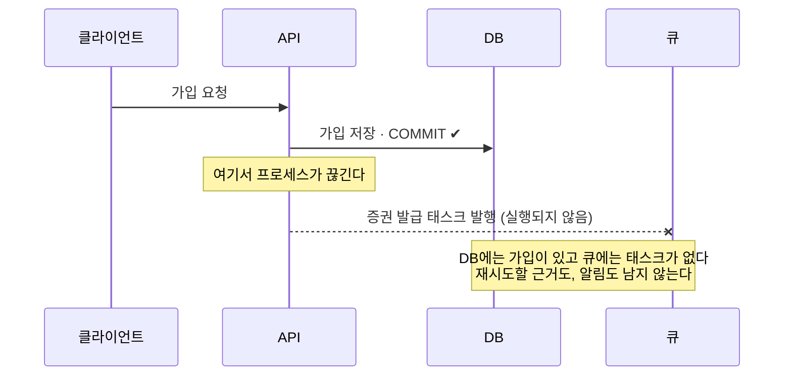
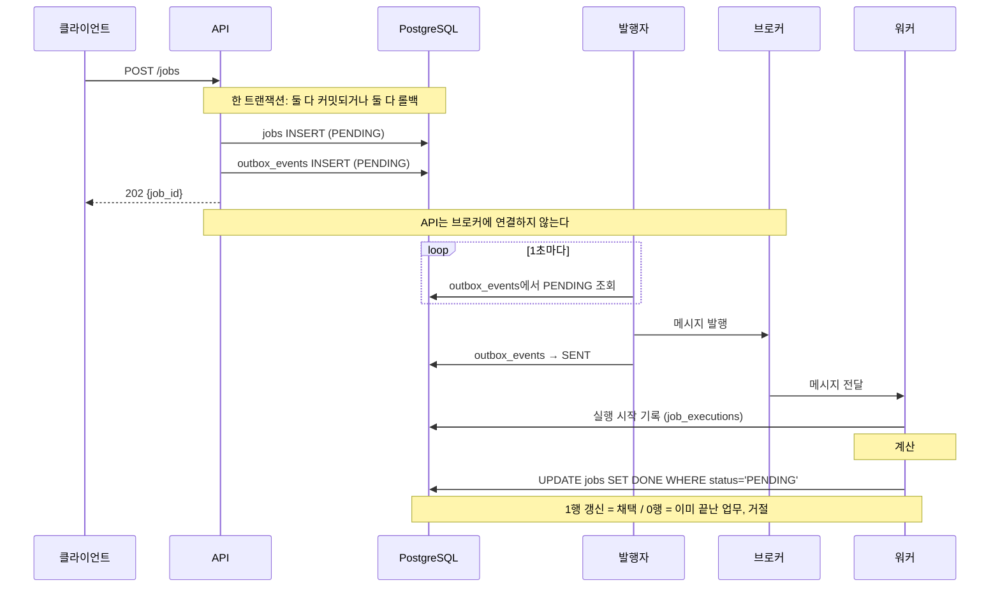
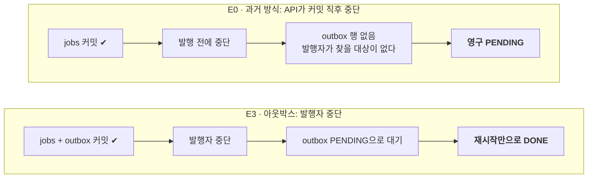

# retro-msg-queue: 트랜잭셔널 아웃박스 실험

DB 커밋과 메시지 발행 사이에서 업무가 사라지는 문제를 재현하고, 트랜잭셔널 아웃박스로 고친 뒤 장애를 하나씩 주입해 실제로 어떻게 되는지 측정한 프로젝트  
  
**기술 스택**: Python 3.12 · FastAPI · SQLAlchemy · PostgreSQL 16 · Celery · Redis / Amazon SQS · Docker Compose · pytest

<br>

## 배경

과거 보험 프로젝트에서 가입 요청은 DB에 커밋됐지만, 이어서 큐에 넣어야 할 증권 발급 태스크가 등록되지 않은 일이 있었다. API가 커밋한 뒤 직접 큐에 발행하는 구조였기 때문에, 그 사이에서 프로세스가 끊기면 태스크는 흔적 없이 사라졌다.



문제는 두 가지였다.

- **유실**: 커밋과 발행이 따로 일어나서, 그 사이에서 끊기면 발행이 사라진다.
- **탐지 불가**: "발행해야 했다"는 기록이 어디에도 없어서, 사라졌다는 사실도 알 수 없다.

이 프로젝트는 그 상황을 작게 다시 만들고 두 가지를 확인한다.

1. 과거 방식에서 업무가 실제로 유실되는가.
2. 개선한 구조에서는 발행·전달·실행이 어디서 끊기든 업무가 유실되지 않거나, **유실된 것이 DB에 드러나는가**.

<br>

## 접근

업무 하나가 접수부터 완료까지 지나는 길이다. 커밋과 발행을 한 프로세스가 이어서 하지 않고, **"보내야 한다"는 기록을 먼저 DB에 남긴 뒤 다른 프로세스가 그 기록을 보고 보낸다.**



<br>

### API

API가 하는 일은 두 가지뿐이다. 접수하고, 보여 준다. 계산도 발행도 하지 않는다.

| 요청                                                | 하는 일                                          | 응답                                                                                                       |
| ------------------------------------------------- | --------------------------------------------- | -------------------------------------------------------------------------------------------------------- |
| `POST /jobs` `{"request_key": "...", "value": 7}` | `jobs`와 `outbox_events`에 한 행씩 한 트랜잭션으로 INSERT | `202 {job_id, status: "PENDING"}`                                                                        |
| 같은 `request_key`, 같은 `value`로 다시                  | 새 행을 만들지 않고 기존 업무를 돌려준다                       | `200` (아래 GET과 같은 본문)                                                                                    |
| 같은 `request_key`, 다른 `value`로 다시                  | 거절                                            | `409`                                                                                                    |
| INSERT 도중 예외                                      | 두 테이블 모두 롤백                                   | `500`, 행 없음                                                                                              |
| `GET /jobs/{job_id}`                              | 업무 상태와 아웃박스 상태를 함께 조회                         | `{status, input, result, completed_at, outbox: {status, attempts, last_error, published_at}}`. 없으면 `404` |

`request_key`는 클라이언트가 정하는 중복 방지 키다. 워커가 하는 계산은 `value`의 제곱이고, 결과에는 실행마다 새로 만드는 `execution_id`가 들어간다. 이 값이 바뀌지 않았다는 것이 "첫 실행 결과가 지켜졌다"의 증거다.

<br>

### 구성 요소

| 구성 요소                      | 역할                                                                                                                           |
| -------------------------- | ---------------------------------------------------------------------------------------------------------------------------- |
| API (`api` 컨테이너)           | 요청을 받아 업무(`jobs`)와 발행 의도(`outbox_events`)를 한 트랜잭션으로 저장한다. 브로커에는 연결하지 않는다                                                     |
| 발행자 (`publisher` 컨테이너)     | 1초마다 `outbox_events`의 `PENDING` 행을 읽어 브로커로 보내고 `SENT`로 기록하는 별도 프로세스. 실패하면 시도 횟수와 오류를 남기고 다음 주기에 다시 시도한다                      |
| 브로커 (Redis 또는 Amazon SQS)  | 메시지를 워커에게 전달하는 큐. 실험마다 둘 중 하나를 쓴다                                                                                            |
| 워커 (`worker` 컨테이너, Celery) | 메시지를 받아 계산하고 `UPDATE jobs SET status='DONE' ... WHERE status='PENDING'`으로 결과를 저장한다. 중복 실행이 일어나도 먼저 들어온 결과 하나만 반영되고 덮어써지지 않는다 |
| DB (PostgreSQL)            | `jobs`, `outbox_events`, `job_executions`(실행 기록) 세 테이블                                                                       |

api · publisher · worker는 각각 따로 뜨고 따로 죽는다. 실험은 이 중 하나를 골라 멈추거나 죽이는 식으로 진행한다.

실행 자체가 한 번뿐이라고는 보장하지 않는다. 보장하는 것은 **채택된 결과가 한 번만 반영되는 것**이다.

<br>

### 실험에서 보게 되는 상태

| 어디                     | 상태             | 뜻                                  |
| ---------------------- | -------------- | ---------------------------------- |
| `jobs.status`          | `PENDING`      | 업무가 접수됐고 아직 결과가 없다                 |
|                        | `DONE`         | 결과가 채택됐다                           |
| `outbox_events.status` | `PENDING`      | 브로커로 보내야 하는데 아직 안 보냈다. 발행자가 집어갈 대상 |
|                        | `SENT`         | 브로커로 보냈다고 기록했다. 업무가 끝났다는 뜻은 아니다    |
| `job_executions`       | 시작 기록만 있음      | 워커가 실행을 시작했지만 끝났다는 기록이 없다          |
|                        | 시작·종료 기록 모두 있음 | 실행 한 번이 끝났다 (채택 또는 거절)             |

두 테이블을 함께 읽어야 뜻이 잡히는 조합이 있다.

| 조합                             | 뜻                                                                                        | 실험         |
| ------------------------------ | ---------------------------------------------------------------------------------------- | ---------- |
| `outbox.SENT` + `jobs.PENDING` | "보냈는데 안 끝남". 메시지가 워커에 닿지 않았는지, 실행 중인지, 실행하다 죽었는지 이것만으로는 알 수 없다. 그래서 실행 기록으로 아래 네 갈래로 나눈다 | E4, E8~E11 |
| `jobs.DONE` + `outbox.PENDING` | 업무는 끝났는데 보냈다는 기록이 없다. 발행 직후, 기록 전에 발행자가 죽으면 생긴다                                          | E5         |
| `jobs` 행은 있고 `outbox` 행이 없음    | 과거 방식에서만 생긴다. 아무도 집어가지 않는다                                                               | E0         |

| "보냈는데 안 끝남"의 네 갈래 | 뜻                                                                 |
| ----------------- | ----------------------------------------------------------------- |
| 미도달               | 실행 기록이 없다. 메시지가 워커에 닿지 않았다                                        |
| 실행 중              | 시작 기록이 있고 60초가 안 지났다                                              |
| 멈춤                | 시작한 지 60초가 넘었는데 끝났다는 기록이 없다. 복구 명령(`run.py reconcile`)이 다시 보내는 대상 |
| 포기                | 끝나지 않은 실행이 3건 쌓였다. 복구 명령이 더 보내지 않고 사람에게 남긴다                       |

<br>

## 대조군: 아웃박스가 해결한 것

과거 방식(E0)과 아웃박스(E3)를 같은 조건으로 돌렸다. 과거 방식은 모든 서비스가 복구된 뒤에도 업무가 영구히 `PENDING`으로 남았고, 아웃박스는 프로세스 재시작만으로 1.3초 만에 `DONE`이 됐다.



중단 지점은 다르지만 E0 쪽이 더 나쁘다. **E0에서는 발행자가 처음부터 끝까지 살아서 1초마다 폴링하는데도** 그 업무를 영원히 찾지 못한다. 조회할 아웃박스 행 자체가 없기 때문이다.

실제 실행 결과 ([E0](reports/E0-20260920-1.md), [E3](reports/E3-20260920-1.md)):

```
 id |  request_key  | status  | outbox
----+---------------+---------+--------
  1 | (E0 · 과거 방식) | PENDING |          ← 모든 서비스 복구 후에도 그대로
  2 | (E3 · 아웃박스) | DONE    | SENT     ← 밀려 있었지만 재시작만으로 완료
```

관측 명령(`run.py backlog`) 한 번에 두 실패가 함께 잡히지만 성격은 반대다.

| 카운터                   | 의미                    | 결말             |
| --------------------- | --------------------- | -------------- |
| `outbox_pending`      | 발행자가 집어갈 것: **대기**    | 재시작하면 자동 복구    |
| `jobs_without_outbox` | 아무도 집어가지 않을 것: **유실** | 사람이 찾아내 수동 재실행 |

<br>

## 실험 결과

위 흐름의 어디서 끊기든 결과가 DB에 남는지를 실험 하나씩으로 확인했다. Redis로 9개를 돌렸고, SQS로 그중 3개를 다시 돌린 뒤 SQS 전용 실험 4개를 더 했다. 리포트 열의 글자가 각 리포트로 가는 링크다.

| #   | 묻는 것                                | 확인한 것                                                                                                                                                             | 리포트                                                                 |
| --- | ----------------------------------- | ----------------------------------------------------------------------------------------------------------------------------------------------------------------- | ------------------------------------------------------------------- |
| E0  | 아웃박스 없는 과거 방식은 실제로 유실되는가            | 커밋 직후 API가 죽자 `jobs` 행만 남고 발행 흔적이 없다. 모든 서비스를 복구해도 영구 `PENDING`이고, 시스템 안에서 누락을 알 방법이 없다                                                                           | [Redis](reports/E0-20260920-1.md)                                   |
| E1  | 정상 흐름                               | 접수→완료 약 2초. 그중 1초는 발행자 폴링 주기. 브로커를 바꿔도 같다                                                                                                                         | [Redis](reports/E1-20260920-1.md) · [SQS](reports/E1-20260921-2.md) |
| E2  | 트랜잭션 도중 예외가 나면 반쪽 커밋이 남는가           | 두 테이블 모두 롤백되고 500. 같은 `request_key`로 다시 접수할 수 있다                                                                                                                  | [Redis](reports/E2-20260920-1.md)                                   |
| E3  | 발행자가 죽으면 업무가 유실되는가                  | 접수는 계속 202. `outbox`에 `PENDING`(attempts=0)으로 남고, 재시작만으로 1.3초 뒤 `DONE`                                                                                            | [Redis](reports/E3-20260920-1.md) · [SQS](reports/E3-20260921-2.md) |
| E4  | 브로커가 죽으면                            | 접수는 계속 202. 실패가 `attempts`·`last_error`에 쌓이고 복구 후 별도 조치 없이 전달. 복구 직후 8초간 `SENT + PENDING` 상태가 실재했다                                                                | [Redis](reports/E4-20260920-1.md)                                   |
| E5  | 발행 후 `SENT` 기록 전에 죽으면 중복이 결과를 덮어쓰는가 | 같은 이벤트가 재발행돼 워커가 두 번 실행됐지만, 결과(`execution_id`)는 첫 실행 것 그대로                                                                                                        | [Redis](reports/E5-20260920-1.md) · [SQS](reports/E5-20260921-2.md) |
| E6  | 같은 메시지가 직렬로 세 번 오면                  | 채택된 결과 하나. 두 번째부터는 사전 조회에서 걸러져 계산도 하지 않았다. 조건부 UPDATE는 실행되지 않았다                                                                                                   | [Redis](reports/E6-20260920-1.md)                                   |
| E6b | 같은 메시지가 동시에 오면                      | 둘 다 사전 조회를 통과해 계산까지 했고, 조건부 UPDATE가 7ms 차이로 하나만 채택했다(rowcount 1 / 0)                                                                                              | [Redis](reports/E6b-20260920-1.md)                                  |
| E7  | 같은 요청을 HTTP로 다시 보내면                 | 같은 입력은 같은 `job_id`로 200, 다른 입력은 409. 행 수는 1로 불변                                                                                                                   | [Redis](reports/E7-20260920-1.md)                                   |
| E8  | 실행 중 워커가 죽으면 메시지는 소실되는가, 재전달되는가     | ACK(워커가 브로커에 보내는 "처리 끝" 신호)를 받자마자 보내는 설정(`acks_late=False`)에서는 소실되고 `SENT + PENDING`이 영구 잔류. 실행을 마친 뒤 보내는 설정(`acks_late=True`)에서는 큐가 정한 30초 뒤 같은 메시지가 재전달돼 `DONE` | [SQS](reports/E8-20260921-1.md)                                     |
| E9  | 계속 죽는 메시지는 어떻게 되는가                  | 수신 3회 뒤 DLQ(Dead Letter Queue, 계속 실패한 메시지를 격리해 두는 큐)로 이동하고 업무는 `PENDING`으로 남는다. 재전달 간격은 큐 설정(30초)이 아니라 Celery 쪽 설정(10초)이 정했다                                      | [SQS](reports/E9-20260921-1.md)                                     |
| E10 | `SENT + PENDING`을 실행 기록으로 가를 수 있는가  | 미도달·실행 중·멈춤·포기 네 갈래 모두 관측. 워커 kill 한 번이 두 업무를 서로 다른 갈래에 놓았다                                                                                                       | [SQS](reports/E10-20260922-1.md)                                    |
| E11 | 복구 명령이 멈춘 업무를 되살리고 3회에서 멈추는가        | 멈춘 업무는 새 메시지로 `DONE`. DLQ로 격리된 업무는 건드리지 않았고, 계속 죽는 업무는 3회에서 포기로 분류됐다                                                                                              | [SQS](reports/E11-20260922-1.md)                                    |

한 브로커의 결과로 다른 브로커의 칸을 채우지 않았다. E1·E3·E5가 두 브로커에서 같았던 것은 이들이 브로커가 아니라 **DB 커밋과 발행을 분리한 구조**를 확인하기 때문이다. 브로커의 차이는 ACK 시점을 바꾼 E8부터 드러났다. Redis에는 DLQ에 해당하는 기능이 없어서 E8 이후는 SQS에서만 돌렸다. RabbitMQ 등 다른 브로커는 다루지 않았다.

<br>

## 예상과 달랐던 것

1. **브로커가 죽었을 때 발행 호출은 예상한 6초가 아니라 10초 걸렸다.** 컨테이너를 멈추면 DNS 항목이 사라져 이름 해석 실패가 되고, 그것만으로 3.9초가 걸린다. 재시도를 꺼도 3.9초 밑으로는 줄지 않았다 ([E1](reports/E1-20260920-1.md)).
2. **"보냈는데 안 끝남"(**`outbox.SENT` **+** `jobs.PENDING`**) 상태가 8초 동안 실제로 있었다.** 브로커가 복구된 뒤 워커의 재접속 백오프 때문이다 ([E4](reports/E4-20260920-1.md)).
3. **핵심 보장 장치인 조건부 UPDATE의 거절 분기는 동시 실행을 억지로 만들어야만 실행됐다.** 워커 동시성 1에서는 사전 조회가 항상 먼저 걸러서, E1~E7 어디에서도 이 분기가 돌지 않았다. 동시성 2에 3초 지연을 줘서 두 실행이 7밀리초 차이로 갈리는 것을 확인했다 ([E6b](reports/E6b-20260920-1.md)).
4. **재전달 간격을 정하는 값이 죽는 방식에 따라 달랐다.** 워커 전체가 죽으면 SQS 큐의 visibility timeout(워커가 받은 메시지를 다른 워커에게 숨겨 두는 시간, 30.003초)이었고, 자식 프로세스만 죽어 부모가 메시지를 되돌리면 kombu(Celery가 브로커와 통신할 때 쓰는 라이브러리)의 `wait_time_seconds`(롱 폴링 대기 시간, 10.07초)였다 ([E8](reports/E8-20260921-1.md), [E9](reports/E9-20260921-1.md)).
5. **같은 "3회 후 멈춤"이라도 누가 다시 보냈는지에 따라 흔적이 달랐다.** 브로커가 재전달하면 메시지 ID(`task_id`)가 같고, 복구 명령이 재발행하면 매번 바뀌었다. 복구 직후 재발송이 설명되지 않는 30.1초 동안 실행되지 않은 일도 있었고, 원인은 확인하지 못했다 ([E10](reports/E10-20260922-1.md), [E11](reports/E11-20260922-1.md)).

<br>

## 한계

- DB와 브로커를 하나의 원자적 트랜잭션으로 묶지 않는다.
- 함수가 한 번만 실행된다고 보장하지 않는다. 보장하는 것은 채택된 DB 결과가 한 번만 반영되는 것이다. DB 밖 부작용(결제·파일·메일)의 중복은 다루지 않는다.
- 브로커가 메시지를 쥐고 있는지 DB는 모른다. 메시지 소실과 DLQ 격리는 미완료 실행 수로 **추정**할 뿐이다. 워커에 닿기 전에 사라진 메시지는 "미도달"로 계속 남고 복구 명령도 구하지 못한다.
- 복구는 자동이 아니다. 복구 명령은 사람이 돌리고, 60초 기준은 느린 정상 작업을 멈춤으로 잘못 볼 수 있다.
- DLQ로 간 업무와 포기한 업무는 되살리지 않는다. 되돌리는 것은 사람의 몫이다.
- 브로커는 Redis와 Amazon SQS만 썼다. RabbitMQ 등 다른 브로커는 실험하지 않았다.
