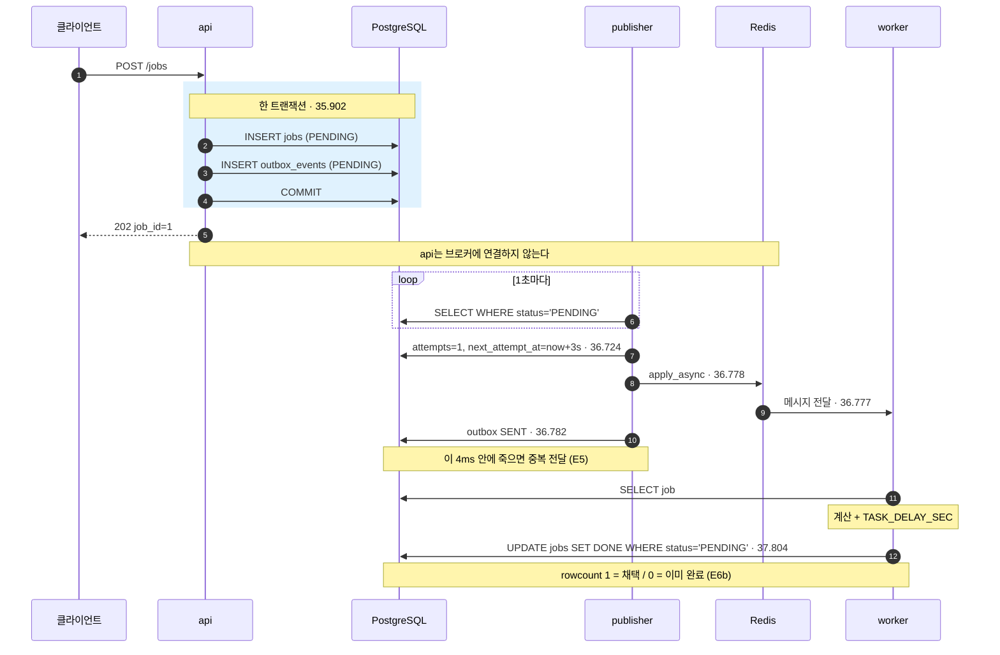
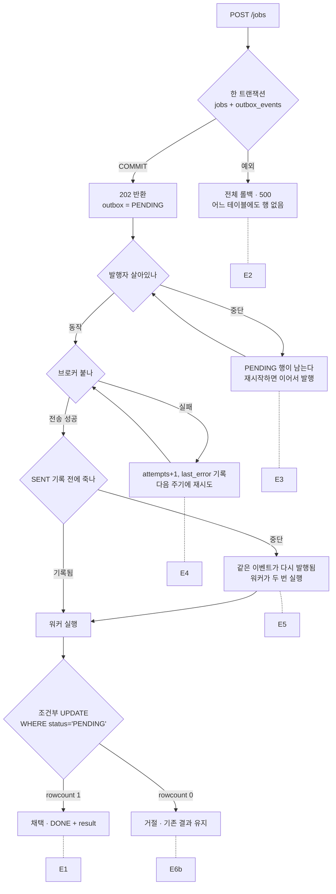
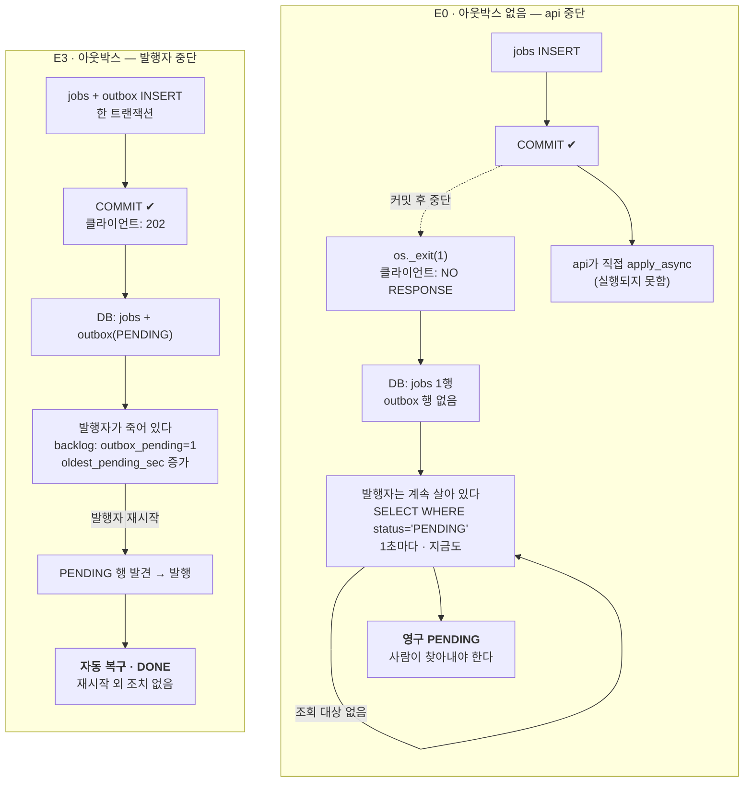

# retro-msg-queue — 트랜잭셔널 아웃박스 학습 MVP

과거 보험 프로젝트에서 "가입은 커밋됐는데 증권 태스크가 큐에 등록되지 않았고, 그것을 탐지할 근거조차 없었다"는 지점을 손으로 재현·개선하는 학습 프로젝트다. 서비스가 아니다.

- 설계·결정: [`dev-plan.md`](dev-plan.md) (v3)
- 진행 상태: [`roadmap.md`](roadmap.md)
- 7단계 실습서: [`practice/step7.md`](practice/step7.md) — `SENT + PENDING` 탐지·복구(E10·E11)를 직접 돌려 보는 절차
- 과거 프로젝트 정리: `insurance_message_queue_interview_notes_2026-09-16.md` (개인 자료, git 미추적)
- 실습 회고: `retrospective.md` — 과거 프로젝트의 미확인 지점과 실험의 대응 (개인 자료, git 미추적)

**한 문장으로:** 업무 접수와 발행 의도를 한 트랜잭션에 커밋하고(아웃박스), 발행·전달·실행이 어디서 끊기든 업무가 유실되지 않거나 **유실된 것이 DB에 드러나게** 하며, 결과는 조건부 UPDATE로 **한 번만** 채택한다. 실행 자체가 한 번이라고는 보장하지 않는다.

1~7단계 완료. Redis로 실험 9개, SQS로 재실행 3개와 SQS 전용 실험 4개(E8 재전달, E9 DLQ, E10 `SENT + PENDING` 분류, E11 복구와 상한)를 실제로 돌리고 리포트를 남겼다.

## 실험

| # | 묻는 것 | Redis | SQS |
|---|---|---|---|
| E0 | 대조군 — 아웃박스 없는 과거 방식은 실제로 유실되는가 | [통과](reports/E0-20260920-1.md) | — |
| E1 | 정상 흐름 | [통과](reports/E1-20260920-1.md) | [통과](reports/E1-20260921-2.md) |
| E2 | 트랜잭션 롤백 — 반쪽 커밋이 남는가 | [통과](reports/E2-20260920-1.md) | — |
| E3 | 발행자 중단 — 적체로 남고 스스로 복구되는가 | [통과](reports/E3-20260920-1.md) | [통과](reports/E3-20260921-2.md) |
| E4 | 브로커 접속 실패 | [통과](reports/E4-20260920-1.md) | — |
| E5 | 발행 후 기록 전 중단 — 재발행 중복이 결과를 덮어쓰는가 | [통과](reports/E5-20260920-1.md) | [통과](reports/E5-20260921-2.md) |
| E6 | 중복 전달 (직렬) | [통과](reports/E6-20260920-1.md) | — |
| E6b | 중복 전달 (동시) — 조건부 UPDATE가 승자를 가리는가 | [통과](reports/E6b-20260920-1.md) | — |
| E7 | HTTP 중복 접수 | [통과](reports/E7-20260920-1.md) | — |
| E8 | 워커 kill × `acks_late` — 메시지는 소실되는가, 재전달되는가 | — | [통과](reports/E8-20260921-1.md) |
| E9 | 독약 메시지 — DLQ가 반복을 끊는가, 업무는 어떻게 남는가 | — | [통과](reports/E9-20260921-1.md) |
| E10 | `SENT + PENDING`을 실행 기록으로 네 갈래(미도달·실행 중·멈춤·포기)로 가를 수 있는가 | — | [통과](reports/E10-20260922-1.md) |
| E11 | `reconcile`이 멈춘 업무를 되살리고, 계속 죽는 업무에서는 3회에서 멈추는가 | — | [통과](reports/E11-20260922-1.md) |

`—`는 실행하지 않았다는 뜻이다. 한 브로커의 결과로 다른 브로커의 칸을 채우지 않는다. E1·E3·E5가 두 브로커에서 같았던 것은 이들이 브로커가 아니라 **DB 커밋과 발행을 분리한 구조**를 확인하기 때문이다. 브로커의 차이는 ACK 시점을 바꾼 E8부터 드러났다. E8·E9는 SQS 전용으로 진행했다 — DLQ는 Redis transport에 대응물이 없다 (R17). E10·E11은 E8·E9 상태를 재현해 쓰므로 역시 SQS 전용이고, 사용자가 [실습서](practice/step7.md)를 따라 직접 돌렸다 (U8).

## 실측 하이라이트 — 예상과 달랐던 것

1. **브로커가 죽었을 때 `apply_async`는 예상 6초가 아니라 10초 걸렸다.** `docker compose stop`이 컨테이너 DNS 항목을 지워 이름 해석 실패가 되고, 그 자체가 3.9초다. 재시도를 꺼도(`max_retries: 0`) 3.9초 밑으로는 못 줄인다 (R9, [E1](reports/E1-20260920-1.md)).
2. **`outbox.SENT + jobs.PENDING` 상태가 8초간 실제로 존재했다.** 브로커 복구 뒤 워커의 재접속 백오프 때문이다. "보냈는데 안 끝남"이 이론이 아니라 관측된 상태다 ([E4](reports/E4-20260920-1.md)).
3. **조건부 UPDATE의 `rowcount=0` 분기는 동시 실행을 억지로 만들어야만 실행됐다.** concurrency 1에서는 사전 조회가 항상 먼저 걸러서, 핵심 보장 장치가 E1~E7 어디서도 돌지 않았다. concurrency 2와 3초 지연을 줘서 두 실행이 7밀리초 차이로 갈리는 것을 봤다 (R13, [E6b](reports/E6b-20260920-1.md)).
4. **재전달 간격을 정하는 값이 죽는 방식에 따라 다른 곳에 있었다.** 워커 전체가 죽으면 큐의 VisibilityTimeout(30.003초), 자식만 죽어 부모가 되돌리면 kombu의 `wait_time_seconds`(10.07초)였다 ([E8](reports/E8-20260921-1.md), [E9](reports/E9-20260921-1.md)).
5. **워커 kill 한 번이 두 업무를 서로 다른 칸에 놓았다.** `acks_late=False`에서 이미 받은 메시지는 워커와 함께 사라져 `stalled`가 됐고, 워커가 바빠 큐에서 기다리던 메시지는 살아남아 새 워커가 처리했다. 같은 "3회 후 멈춤"도 브로커가 다시 보내면 `task_id`가 같고(DLQ가 멈춤), `reconcile`이 다시 보내면 매번 달랐다(상한이 멈춤). 복구 직후 재발송이 설명되지 않는 30.1초 동안 실행되지 않은 일도 있었다 ([E10](reports/E10-20260922-1.md), [E11](reports/E11-20260922-1.md)).

---

## 이 MVP가 보장하지 않는 것

- DB와 브로커를 하나의 원자적 트랜잭션으로 묶는 것.
- 함수 실행이 반드시 한 번뿐인 것. 보장하는 것은 **채택된 DB 결과가 한 번만 반영되고 덮어써지지 않는 것**이다.
- `outbox.SENT + jobs.PENDING`만으로 상황을 구분하는 것. 7단계의 실행 기록(`job_executions`)으로 "미도달·실행 중·멈춤·포기"는 가른다 (E10). 그래도 "메시지 소실"(E8 대조군)과 "DLQ 격리"(E9)는 미완료 실행 수(1건 / 3건)로 **추정**할 뿐이다 — 브로커가 메시지를 쥐고 있는지 DB는 모른다. 워커에 닿기 전에 사라진 메시지는 `not_started`에 영원히 남고 `reconcile`도 구하지 못한다.
- 자동 복구. `reconcile`은 사람이 돌리는 명령이고, 미완료 실행 3건이 되면 더 보내지 않는다 (E11). 60초 기준은 느린 정상 작업을 멈춤으로 오판할 수 있다.
- DB 밖 부작용(결제·파일·메일)의 중복 방지. 이 MVP는 DB 결과 저장만 다룬다.
- DLQ로 간 업무와 `gave_up` 업무의 복구. DLQ는 전달 반복을 끊을 뿐이고, 업무는 `PENDING`으로 남는다 (E9). `reconcile`도 `gave_up`은 되살리지 않는다 (E11). 되돌리기(redrive, `run.py republish`)는 사람이 한다.

자세한 것은 dev-plan.md §10, 후속 항목은 §13.

---

## 구조

### 정상 흐름 (E1 실측 타임스탬프)

아래 시각은 `reports/E1-20260920-1.md`의 실제 로그에서 가져온 것이다. 접수부터 완료까지 1.9초.



### 실패 지점과 실험의 대응

각 분기점이 실험 하나에 대응한다.



### E0 대조군 — 아웃박스가 산 것

과거 보험 프로젝트는 왼쪽이었다. "가입은 저장됐는데 증권 작업은 흔적도 없이 사라지고, 오류 알림조차 없어 탐지할 근거가 없었다"(면접 정리 8.7절). 둘을 같은 조건으로 돌린 결과가 [E0](reports/E0-20260920-1.md)와 [E3](reports/E3-20260920-1.md)다 — 왼쪽은 모든 서비스가 복구된 뒤에도 영구 PENDING, 오른쪽은 프로세스 재시작만으로 1.3초 만에 DONE.

**두 실험의 중단 지점이 다르다.** E0은 api가 죽고, E3은 발행자가 죽는다. 그런데도 E0 쪽이 더 나쁘다 — **E0에서는 발행자가 처음부터 끝까지 멀쩡히 살아 1초마다 폴링하고 있는데도** 그 행을 영원히 못 본다. 조회 대상 자체가 없기 때문이다.



실제 실행 결과 (`reports/E0-20260920-1.md`, `reports/E3-20260920-1.md`):

```
 id |  request_key  | status  | outbox
----+---------------+---------+--------
  1 | (E0 · 레거시)  | PENDING |          ← 모든 서비스 복구 후에도 그대로
  2 | (E3 · 아웃박스) | DONE    | SENT     ← 밀려 있었지만 재시작만으로 완료
```

`run.py backlog` 한 줄에 두 실패가 같이 잡히는데 성격이 반대다.

| 카운터 | 의미 | 결말 |
|---|---|---|
| `outbox_pending` | 발행자가 집어갈 것 — **대기** | 재시작하면 자동 복구 |
| `jobs_without_outbox` | 아무도 집어가지 않을 것 — **유실** | 사람이 찾아내 수동 재실행 |

둘 다 "접수됐는데 안 끝난 건"을 세지만, 하나는 줄에 서 있고 하나는 줄 밖으로 떨어졌다.

### 식별자 네 개

| 식별자 | 만드는 주체 | 식별 대상 | 재전달 시 |
|---|---|---|---|
| `job_id` | api (DB 시퀀스) | 업무 | 그대로 |
| `event_id` | api (DB 시퀀스) | 발행 요청 | 그대로 |
| `task_id` | Celery | 메시지 한 통 | 새로 생성 |
| `execution_id` | worker | 실행 한 번 | 새로 생성 |

`result.execution_id`가 바뀌지 않는다는 것이 "첫 실행 결과가 지켜졌다"의 증거다. 면접 정리 9.4~9.5절의 "S3 실행별 경로 + DB 채택 포인터"를 파일 없이 DB만으로 축소한 형태다.

---

## 실행 방법 (PowerShell)

### 준비

```powershell
cd C:\Users\FAMILY\projs\retro-msg-queue
```

`.env`가 없으면 만든다:

```powershell
Copy-Item .env.example .env
```

전체 스택(postgres · redis · api · publisher · worker)을 띄운다:

```powershell
docker compose --profile redis up -d --build
```

`--profile redis`를 빼면 redis가 뜨지 않는다. 브로커 없이 접수만 볼 때(1단계 범위)나 E4 상황을 만들 때 쓴다. **`BROKER_KIND`(`.env`)와 compose 프로필은 서로를 강제하지 않는다** — `BROKER_KIND=redis`인데 프로필을 빼면 발행자가 계속 실패한다 (R16).

호스트 8000번을 다른 프로젝트가 쓰고 있으면 `API_PORT`로 옮긴다. 실험은 compose 네트워크(`http://api:8000`)로 돌기 때문에 이 매핑에 의존하지 않는다.

```powershell
$env:API_PORT="8001"
```

기동 확인:

```powershell
docker compose ps
```

```powershell
docker compose logs api --tail 20
```

`db_ready` → `db_init_done tables=jobs,outbox_events` → `Application startup complete.` 가 보이면 정상이다. 발행자와 워커도 확인한다:

```powershell
docker compose logs publisher --tail 5
```

```powershell
docker compose logs worker --tail 5
```

발행자는 `phase=publisher_start`, 워커는 `Connected to redis://redis:6379/0` 과 `celery@... ready.` 가 보이면 정상이다.

### 테스트

```powershell
docker compose exec api pytest -q
```

`conftest.py`가 `DATABASE_URL`의 DB 이름을 `app_test`로 바꾼 뒤 앱 모듈을 임포트한다. 실험 DB(`app`)를 건드릴 경로가 없다.

### 실험 CLI

접수:

```powershell
docker compose exec api python experiments/run.py create `
  --request-key my-key-001 --value 7
```

조회:

```powershell
docker compose exec api python experiments/run.py get --job-id 1
```

행 수 (E2·E7 확인용):

```powershell
docker compose exec api python experiments/run.py count `
  --request-key my-key-001
```

완료까지 폴링 (jobs.DONE + outbox.SENT):

```powershell
docker compose exec api python experiments/run.py wait --job-id 1 --timeout 30
```

적체 관측 (읽기 전용):

```powershell
docker compose exec api python experiments/run.py backlog
```

같은 이벤트를 수동 재발행 (outbox 상태는 건드리지 않는다):

```powershell
docker compose exec api python experiments/run.py republish --event-id 1
```

### DB 직접 조회

```powershell
docker compose exec postgres psql -U app -d app `
  -c "SELECT id, request_key, status, input FROM jobs ORDER BY id;"
```

```powershell
docker compose exec postgres psql -U app -d app `
  -c "SELECT id, job_id, status, attempts, last_error FROM outbox_events ORDER BY id;"
```

### 장애 주입 (E2)

플래그를 켜고 api 재기동:

```powershell
$env:API_CRASH_BEFORE_OUTBOX="1"
docker compose up -d --force-recreate api
docker compose exec api printenv API_CRASH_BEFORE_OUTBOX
```

`1`이 나와야 한다. 접수하면 500이 난다:

```powershell
docker compose exec api python experiments/run.py create `
  --request-key crash-001 --value 42
```

두 테이블 모두 0이어야 한다:

```powershell
docker compose exec api python experiments/run.py count `
  --request-key crash-001
```

플래그를 끄고 재기동:

```powershell
Remove-Item Env:\API_CRASH_BEFORE_OUTBOX
docker compose up -d --force-recreate api
docker compose exec api printenv API_CRASH_BEFORE_OUTBOX
```

`0`이 나와야 한다. **같은 request_key로 다시 접수해 202를 확인한다** — 롤백된 행이 `request_key`를 점유하고 있지 않았다는 증거다:

```powershell
docker compose exec api python experiments/run.py create `
  --request-key crash-001 --value 42
```

플래그는 셸 환경변수로만 켠다. HTTP로 켜고 끄는 경로는 만들지 않는다 (dev-plan §12).

### 장애 주입 (E3 · E4)

발행자를 멈춘다. 접수는 계속 202이고 `outbox_events`에 PENDING이 쌓인다:

```powershell
docker compose stop publisher
```

```powershell
docker compose exec api python experiments/run.py backlog
```

재시작하면 밀린 것을 자동으로 집어간다:

```powershell
docker compose start publisher
```

브로커를 멈춘다. 접수는 여전히 202이고 `attempts`·`last_error`가 쌓인다:

```powershell
docker compose stop redis
```

5~15초 뒤에 보면 `attempts≥2`다:

```powershell
docker compose exec api python experiments/run.py get --job-id 1
```

```powershell
docker compose start redis
```

### E0 대조군 (아웃박스 없는 과거 방식)

두 플래그를 켜면 API가 `outbox_events` 없이 커밋하고, 커밋과 발행 사이에 죽는다:

```powershell
$env:LEGACY_INLINE_PUBLISH="1"; $env:API_CRASH_AFTER_COMMIT="1"
docker compose --profile redis up -d --force-recreate api
```

api가 죽을 것이므로 요청은 다른 컨테이너에서 보낸다:

```powershell
docker compose exec publisher python experiments/run.py create `
  --request-key legacy-001 --value 7
```

`NO RESPONSE`가 나온다. 남은 흔적을 확인한다 — `jobs` 행만 있고 `outbox_pending`은 0이다:

```powershell
docker compose exec publisher python experiments/run.py backlog
```

플래그를 끄고 복구해도 그 행은 영원히 PENDING이다:

```powershell
Remove-Item Env:\LEGACY_INLINE_PUBLISH; Remove-Item Env:\API_CRASH_AFTER_COMMIT
docker compose --profile redis up -d --force-recreate api
```

### 발행 후 기록 전 중단 (E5)

**먼저 미발행 잔여 행이 없는지 확인한다** — 플래그가 켜진 발행자는 처음 집은 이벤트에서 죽는다:

```powershell
docker compose exec api python experiments/run.py backlog
```

```powershell
$env:PUBLISHER_CRASH_AFTER_SEND="1"
docker compose --profile redis up -d --force-recreate publisher
```

```powershell
docker compose exec api python experiments/run.py create `
  --request-key e5-001 --value 7
```

발행자가 죽는다. 이때 GET을 보면 **`jobs.DONE` + `outbox.PENDING`** 이다 — 작업은 끝났는데 아웃박스는 안 보냈다고 기록하고 있다:

```powershell
docker compose exec api python experiments/run.py get --job-id 1
```

플래그를 끄고 되살리면 같은 이벤트를 다시 발행하고, 워커가 두 번째로 실행하지만 결과는 안 바뀐다:

```powershell
Remove-Item Env:\PUBLISHER_CRASH_AFTER_SEND
docker compose --profile redis up -d --force-recreate publisher
```

### 조건부 UPDATE 실증 (E6b)

concurrency=1에서는 사전 조회가 항상 먼저 걸려 `rejected_already_done`이 나오지 않는다. 동시 실행 창을 만든다:

```powershell
docker compose stop publisher
```

```powershell
$env:CELERY_CONCURRENCY="2"; $env:TASK_DELAY_SEC="3"
docker compose --profile redis up -d --force-recreate worker
```

```powershell
docker compose exec api python experiments/run.py create `
  --request-key e6b-001 --value 7
```

두 재발행을 병렬로 던진다:

```powershell
docker compose exec api sh -c 'python experiments/run.py republish --event-id 1 & python experiments/run.py republish --event-id 1 & wait'
```

워커 로그에 `adopted` 1건 + `rejected_already_done` 1건이 나온다:

```powershell
docker compose logs worker --tail 10
```

끝나면 기본값으로 되돌린다:

```powershell
Remove-Item Env:\CELERY_CONCURRENCY; Remove-Item Env:\TASK_DELAY_SEC
docker compose --profile redis up -d --force-recreate worker publisher
```

### 정리

컨테이너만 내린다:

```powershell
docker compose down
```

볼륨(DB 데이터)까지 지운다. `app_test`는 볼륨 최초 생성 시 initdb로 만들어지므로 다음 `up`에서 함께 재생성된다:

```powershell
docker compose down -v
```

### PowerShell에서 명령이 길 때

줄을 나누려면 **줄 끝에 백틱(`` ` ``)** 을 붙인다. 백틱 뒤에 공백이 하나라도 있으면 연결되지 않고 `단항 연산자 '--' 뒤에 식이 없습니다` 같은 파싱 오류가 난다.

```powershell
docker compose exec api python experiments/run.py create `
  --request-key my-key-001 --value 7
```

백틱 없이 그냥 개행하면 각 줄이 별개 명령으로 실행된다. 이 README의 코드 블록은 그대로 복사해도 되도록 백틱을 붙여 뒀다.

---

## SQS로 실행하기 (5단계)

브로커를 Amazon SQS로 바꾼다. **발행 코드·태스크·DB 조회는 하나도 바뀌지 않는다** — `.env`와 자격 증명만 다르다.

### 사용자가 준비하는 것

애플리케이션은 AWS 자원을 만들지 않는다 (dev-plan §1). 큐·IAM은 사람이 준비한다.

1. **Standard 큐** 생성. FIFO가 아니다. **큐 이름은 `CELERY_QUEUE`와 정확히 같아야 한다** (기본 `jobs`) — `predefined_queues`의 키가 Celery 큐 이름이기 때문이다 (R14).
2. 암호화는 **SSE-SQS(기본값)** 로 둔다. SSE-KMS로 바꾸면 `kms:Decrypt`·`kms:GenerateDataKey` 권한이 추가로 필요하다.
3. **IAM 사용자**를 따로 만들고 이 큐에만 권한을 준다. 컨테이너가 `~/.aws`를 통째로 보게 되므로 전용 사용자가 안전하다.
4. 액세스 키를 발급받아 **프로파일로 등록**한다. `.env`에 키를 쓰지 않는다.

```powershell
aws configure --profile retro-msg-queue
```

### 필요한 권한

이 MVP가 실제로 호출하는 SQS API는 네 개다.

| API | 호출 주체 |
|---|---|
| `sqs:SendMessage` | 발행자 (`apply_async`) |
| `sqs:ReceiveMessage` | 워커 (롱 폴링) |
| `sqs:DeleteMessage` | 워커 (수신 직후 ACK, `task_acks_late=False`) |
| `sqs:GetQueueAttributes` | kombu 내부 |

`predefined_queues`로 기존 큐를 참조하므로 `CreateQueue`·`ListQueues`는 필요 없다. `task_acks_late=False`이고 백오프 정책도 쓰지 않으므로 `ChangeMessageVisibility`도 필요 없다. 실험 편의(`PurgeQueue` 등)를 남기려면 Action을 `sqs:*`로 두되 **Resource를 그 큐 하나로 한정**한다.

```json
{
  "Version": "2012-10-17",
  "Statement": [
    {
      "Effect": "Allow",
      "Action": ["sqs:*"],
      "Resource": "arn:aws:sqs:<리전>:<계정ID>:jobs"
    }
  ]
}
```

`AmazonSQSFullAccess`를 붙여도 동작은 하지만 내용이 `{"Action": ["sqs:*"], "Resource": "*"}`라서 계정 전체·전 리전의 모든 큐가 대상이 된다. 권장하지 않는다.

### `.env`

```
BROKER_KIND=sqs
SQS_REGION=ap-northeast-2
SQS_QUEUE_URL=https://sqs.ap-northeast-2.amazonaws.com/<계정ID>/jobs
AWS_PROFILE=retro-msg-queue
```

`AWS_PROFILE`은 **`.env`에만** 둔다. compose의 `environment:` 블록은 `env_file:`보다 우선하므로, 거기에 같은 키를 두면 `.env` 값이 조용히 무시된다. 자격 증명 자체는 `~/.aws`를 읽기전용으로 마운트해 전달한다 — `.env`에는 키가 들어가지 않는다.

### 기동

**`--profile redis`를 붙이지 않는다.** redis 컨테이너는 SQS 실행 내내 떠 있으면 안 된다.

```powershell
docker compose up -d --build
```

`BROKER_KIND`(`.env`)와 compose 프로필은 서로를 강제하지 않는다 (R16). `--profile sqs`라는 것은 없다 — 매칭되는 서비스가 없어 no-op이다.

### 기동 검증 (R14)

설정이 틀리면 **기동 자체가 실패해야 한다.** 실패가 정상 동작이다.

```powershell
docker compose run --rm -e SQS_QUEUE_URL= api python -c "import app.celery_app"
```

```
RuntimeError: BROKER_KIND=sqs requires SQS_REGION and SQS_QUEUE_URL
```

```powershell
docker compose run --rm -e CELERY_QUEUE=orders api python -c "import app.celery_app"
```

```
RuntimeError: SQS_QUEUE_URL must end with /orders (CELERY_QUEUE), got https://sqs.../jobs
```

### 연결·권한 확인법

자격 증명이 컨테이너 안에서 잡히는지:

```powershell
docker compose run --rm api python -c `
  "import boto3; s=boto3.Session(); print(s.profile_name, s.get_credentials().method)"
```

워커 기동 로그에 두 줄이 나와야 한다.

```
Connected to sqs://localhost//
Found credentials in shared credentials file: ~/.aws/credentials
```

`sqs://localhost//`의 `localhost`는 **실제 접속 대상이 아니다.** broker URL이 자격 증명 없는 `sqs://`라서 Celery가 빈 호스트를 그렇게 출력할 뿐이고, 실제 대상은 transport option의 `predefined_queues`에 있는 큐 URL이다.

증상별 원인:

| 증상 | 원인 |
|---|---|
| `NoCredentialsError` | `AWS_PROFILE` 미설정이거나 `~/.aws` 마운트 실패 |
| `AccessDenied` on `SendMessage` | IAM 정책의 Resource가 이 큐와 다름 |
| `AccessDenied` on `ListQueues` | **정상** — 좁힌 정책에서는 거부된다. 이 MVP는 호출하지 않는다 |
| `UndefinedQueueException` | 큐 이름 ≠ `CELERY_QUEUE`. R14 검증이 먼저 막아야 정상 |

### 큐 상태 관측

SQS에는 `redis-cli llen`에 해당하는 것이 없다. 큐 속성을 조회한다.

```powershell
aws sqs get-queue-attributes --profile retro-msg-queue --region ap-northeast-2 `
  --queue-url <큐URL> `
  --attribute-names ApproximateNumberOfMessages ApproximateNumberOfMessagesNotVisible
```

**`Approximate`라는 이름 그대로 근사값이다.** `llen`과 달리 즉시 정확한 값을 보장하지 않으므로, 0이라는 관측 하나로 "큐가 비었다"를 단정하지 않는다.

### visibility timeout과 ACK

| 항목 | 값 |
|---|---|
| 큐 VisibilityTimeout | 30초 (기본값) |
| MessageRetentionPeriod | 345600초 (4일, 기본값) |
| `task_acks_late` | `False` |
| transport `wait_time_seconds` | 10 (롱 폴링) |
| transport `polling_interval` | 1 |

`task_acks_late=False`이므로 **워커는 메시지를 받자마자 삭제하고 나서 실행한다.** 따라서 visibility timeout 30초는 이 설정에서는 사실상 쓰이지 않는다 — 실행이 30초를 넘겨도 재전달되지 않고, 실행 중 워커가 죽으면 메시지는 이미 사라진 뒤다. 이 조합을 뒤집은 것이 E8·E9다 — `acks_late=True`에서 워커 전체가 죽으면 이 30초 뒤에 재전달되고(E8), 자식만 죽어 부모가 되돌리면 이 값이 아니라 `wait_time_seconds` 10초 뒤에 재전달된다(E9).

---

## 패키지·이미지 버전

`pip index versions`로 2026-09-20 시점 최신 안정판을 확인해 `==`로 고정했다. 아래는 컨테이너에서 실제 확인한 값이다.

| 항목 | 버전 |
|---|---|
| Python | 3.12.14 (`python:3.12-slim`) |
| PostgreSQL | 16.15 (`postgres:16`) |
| fastapi | 0.141.1 |
| uvicorn | 0.53.0 |
| sqlalchemy | 2.0.54 |
| psycopg[binary] | 3.3.6 |
| httpx | 0.28.1 |
| pytest | 9.1.1 |
| Docker Engine | 29.1.2 |
| celery[sqs] | 5.6.3 |
| kombu | 5.6.2 (celery 의존) |
| redis (파이썬 클라이언트) | 8.1.0 |
| Redis 서버 | 7 (`redis:7`) |

---

## 결정 기록

dev-plan.md에 없어서 스스로 정했거나, 검증 결과 문서를 고쳐야 했던 것. 번호는 dev-plan §0 v3 표와 같다.

| # | 결정 | 이유 |
|---|---|---|
| R1 | `init_db()`는 `pg_advisory_xact_lock(987654321)` + `create_all(conn)`을 한 트랜잭션에 | `create_all(checkfirst=True)`는 has_table → CREATE라 비원자다. 2단계에서 api·publisher·worker가 동시에 기동하면 `DuplicateTable`로 한 컨테이너가 죽는다. 잠금으로 직렬화하면 세 프로세스 모두 같은 코드를 쓰고 기동 순서에 의존하지 않는다 |
| R2 | postgres `healthcheck: pg_isready -U app -d app` (interval 2s, retries 30) | dev-plan §7이 `condition: service_healthy`를 요구하면서 healthcheck를 정의하지 않았다. 없으면 의존 서비스가 영원히 대기한다 |
| R3 | `psycopg[binary]==3.3.6` | 소스 빌드와 `libpq-dev` 설치 회피. `postgresql+psycopg://`는 psycopg 3을 요구한다 |
| R4 | `pydantic-settings` 대신 `os.environ` + `Settings` dataclass | 의존성 하나를 줄인다. 장애 주입 플래그를 객체 속성으로 두면 pytest에서 `monkeypatch.setattr`로 켤 수 있어 컨테이너 재기동 없이 롤백 경로를 테스트한다 |
| R5 | pytest 전용 DB `app_test`를 postgres initdb 스크립트로 생성. `conftest.py`가 앱 모듈 임포트 **전에** `DATABASE_URL`의 DB 이름을 `app_test`로 치환하고, 엔진에 반영됐는지 확인 후 진행 | 실험 DB(`app`) 오염 방지. 테스트는 매번 TRUNCATE하므로 섞이면 안 된다. 긴 `-e DATABASE_URL=...` 플래그를 쓰면 PowerShell에서 줄바꿈으로 잘려 붙여넣기 사고가 나고, 잘못된 값을 넘길 여지도 남는다. 치환은 사람이 실수할 경로 자체를 없앤다 |
| R6 | `POST /jobs` 202 본문은 `{job_id, status}`, 중복 200 본문은 GET과 같은 형태 | dev-plan §5 그대로. 통일 제안이 있었으나 스펙을 바꿀 이유가 부족했다. `run.py create`는 status code와 본문을 그대로 출력해 분기하지 않는다 |
| R7 | `.gitattributes` `* text=auto eol=lf`, `PYTHONUNBUFFERED=1`, compose `command:`는 exec 배열 | Windows에서 개발하고 Linux 컨테이너에서 실행한다. `sh -c` 문자열 형식을 쓰면 `sh`가 PID 1이 되어 SIGTERM을 파이썬에 전달하지 않는다 — 2단계 발행자의 graceful shutdown(E3)에 필요하다 |
| R8 | `git init` 후 첫 커밋은 `dev-plan.md`·`roadmap.md`, 이후 `step N:` | dev-plan §12 |
| 추가 | `app/logfmt.py`의 `kv()`로 로그 한 줄에 `phase job_id event_id execution_id task_id attempt`를 항상 포함 | dev-plan §12 로그 규칙. 없는 값은 `-`로 채워 grep·대조가 쉽다 |
| 추가 | `.gitignore`에 `insurance_message_queue_interview_notes_2026-09-16.md` 포함 | 개인 면접 준비 자료다. 저장소에 올리지 않는다 |

### R9 — 브로커 다운 시 `apply_async` (2단계 실측)

dev-plan §7 "2단계 검증 항목". `max_retries: 0`을 적용하기 **전에** 스펙 설정 그대로 측정했다.

| 조건 | 소요 | 예외 |
|---|---|---|
| redis 정상 (기준선) | 0.074초 | — (성공) |
| redis 없음, 스펙 설정 그대로 | 10.00 / 9.82초 | `kombu.exceptions.OperationalError` |
| `stop redis`, 스펙 설정 그대로 | 9.98 / 9.82초 | `kombu.exceptions.OperationalError` |
| `stop redis`, `max_retries: 0` | 4.03 / 3.85 / 3.85초 | `kombu.exceptions.OperationalError` |

메시지는 네 경우 모두 `Error -2 connecting to redis:6379. Name or service not known.`

- **예외 클래스는 예상대로**였다. redis 드라이버 예외가 아니라 kombu가 감싼 것이라 발행자의 `except`는 `kombu.exceptions.OperationalError`를 잡는다.
- **소요 시간은 예상(≈6초)과 달랐다.** 예상은 연결 거부가 즉시 실패한다고 봤지만, `docker compose stop`은 컨테이너 DNS 항목을 지우므로 이름 해석 실패가 되고 그 자체가 ≈3.9초 걸린다. 시도(3.9) → 대기 2초 → 시도(3.9) = 9.8초가 `broker_connection_timeout=4` 예산을 넘겨 raise.
- **컨테이너가 없는 경우와 멈춘 경우가 같다.** 둘 다 DNS 해석 실패다.
- `max_retries: 0` 적용 후 **10초 → 3.9초.** 재시도가 사라졌고 남은 3.9초는 DNS 해석 시간이라 애플리케이션이 줄일 수 없다.

적용 방식: `send_compute`가 `app.connection_for_write(transport_options={"max_retries": 0})`로 만든 **전용 연결**로 `apply_async(connection=...)` 한다. 워커의 재접속 정책(`broker_connection_retry_on_startup`)은 건드리지 않는다. `PUBLISH_CONNECT_MAX_RETRIES`를 빈 값으로 두면 이 덮어쓰기를 끄고 스펙 기본 동작으로 되돌려 실측을 재현할 수 있다.

**E4에 대한 함의** — 실패 1회에 3.9초 + `PUBLISH_RETRY_DELAY_SEC=3`이므로 `attempts=2`는 t≈5초다. 적용 전이라면 t≈11초로, dev-plan v2의 "3~10초 후 확인"은 관측에 실패했을 것이다.

### R10~R13 (2~4단계 적용)

| # | 결정 | 이유 |
|---|---|---|
| R10 | `worker`·`publisher`에 `depends_on: redis`를 넣지 않는다 | profile 없는 서비스가 profile `redis`의 서비스에 의존하면 프로필 미활성 시 `up`이 실패한다. 워커는 `broker_connection_retry_on_startup=True`로, 발행자는 자체 루프로 브로커 부재를 견딘다 — 그 견디는 동작 자체가 E4다 |
| R11 | 워커 `@app.task(bind=True)`, `completed_at=func.now()` | dev-plan §6 의사코드는 `self.request.id`를 쓰면서 bind가 없어 실행되지 않았다. 시각은 DB 기준으로 통일 |
| R12 | E0 대조군을 `LEGACY_INLINE_PUBLISH`·`API_CRASH_AFTER_COMMIT` 플래그 뒤에 구현 | dev-plan v2는 "구현하지 않음"이었으나, 그러면 아웃박스의 개선 효과가 서술로만 남는다. 플래그 뒤 ~30줄로 관측 가능해진다 |
| R13 | E6b에서만 worker `--concurrency=2`, `TASK_DELAY_SEC=3` | concurrency=1에서는 사전 조회가 항상 먼저 걸려 조건부 UPDATE의 `rowcount=0` 분기가 **어떤 실험에서도 실행되지 않는다**. §1 제약의 의도적 이탈이며 실험 후 1로 되돌렸다 |
| 추가 | `run.py backlog`에 `jobs_without_outbox` 카운터 | E0이 남기는 상태(아웃박스 행이 아예 없는 업무)를 센다. `outbox_pending`(대기)과 대비되는 유실 지표 |

### R14~R16 (5단계 적용)

| # | 결정 | 이유 | 실측 |
|---|---|---|---|
| R14 | `SQS_QUEUE_NAME` 환경변수를 두지 않는다. `predefined_queues`의 키는 `CELERY_QUEUE`이고, `SQS_QUEUE_URL`이 `/{CELERY_QUEUE}`로 끝나지 않으면 기동 실패 | kombu SQS transport는 Celery 큐 이름으로 `predefined_queues`를 조회한다. 불일치는 발행 시점에야 `UndefinedQueueException`으로 터지므로 기동에서 막는다 | 3종(빈 URL·빈 리전·이름 불일치) 모두 `RuntimeError`로 기동 차단 확인 |
| R15 | `celery[sqs]`의 pycurl 빌드 의존성을 Dockerfile에 유지 | 5.5의 urllib3 전환이 5.6.0에서 되돌려졌다(처리량 회귀). kombu 5.6 `requirements/extras/sqs.txt`에 pycurl 있음 | 재빌드 없이 SQS 기동 성공 |
| R16 | `--profile sqs`는 만들지 않는다. 기동은 `BROKER_KIND=redis` + `--profile redis` / `BROKER_KIND=sqs` + 프로필 없음 | `BROKER_KIND`(env)와 profile(compose)이 독립이라 어긋나도 아무도 막지 않는다 | SQS 실험 내내 redis 컨테이너 미기동 확인 |
| 추가 | 자격 증명은 `~/.aws`를 `/root/.aws:ro`로 마운트해 전달하고, `AWS_PROFILE`은 `.env`에만 둔다 | `.env`에 AWS 키를 넣지 않는다는 원칙(§9)을 지키면서 컨테이너에 자격 증명을 넣는 방법. compose `environment:`가 `env_file:`보다 우선하므로 양쪽에 두면 `.env`가 무시된다 | 컨테이너 안에서 `shared-credentials-file`로 해석, IAM 사용자 `sqs-user` 확인 |
| 추가 | 호스트 API 포트를 `${API_PORT:-8000}`으로 변수화 | 다른 프로젝트가 8000을 쓰고 있을 때 충돌한다. 실험은 compose 네트워크(`http://api:8000`)로 돌므로 이 매핑에 의존하지 않는다 | `API_PORT=8001`로 전체 실험 수행 |

**`predefined_queues`에 키를 쓰지 않아도 되는 근거** — kombu `transport/SQS.py`의 `new_sqs_client()`는 `q.get('access_key_id', self.conninfo.userid)`로 키를 받아 `boto3.session.Session(aws_access_key_id=...)`에 그대로 넘긴다. `Connection("sqs://")`의 `userid`/`password`는 빈 문자열이 아니라 **`None`**이고, `boto3.Session(aws_access_key_id=None)`은 기본 자격 증명 체인으로 떨어진다. 공식 문서 예시는 모두 키를 항목 안에 직접 넣지만, 넣지 않는 경로도 지원된다.

### R17~R19 (6단계 적용)

| # | 결정 | 이유 | 실측 |
|---|---|---|---|
| R17 | dev-plan §13-2·§13-7을 E8(재전달)·E9(DLQ)로 승격. **SQS 전용** | `acks_late=False`에서는 재전달 경로가 닫혀 있어 1~5단계에서 브로커 차이가 한 번도 드러나지 않았다. DLQ는 Redis transport에 대응물이 없다 | E8에서 처음으로 SQS VisibilityTimeout이 동작 |
| R18 | `TASK_ACKS_LATE`·`TASK_REJECT_ON_WORKER_LOST`를 env로, 기본 0 | 같은 코드로 양쪽을 보고, 기본값 불변이라 1~5단계 재현성이 유지된다 | 기본값에서 pytest 18건 통과 |
| R19 | 독약은 `TASK_CRASH_BEFORE_ADOPT=1` — 자식이 채택 직전 `os._exit(1)`. DLQ `jobs-dlq`, maxReceiveCount 3 | 컨테이너 안에서 자식이 PID 1에 보내는 SIGKILL은 커널이 무시한다. 자식만 죽이면 부모가 `WorkerLostError`를 받고, `reject_on_worker_lost=True`일 때만 되돌린다 | 수신 3회 후 DLQ 이동. 재전달 간격 10.07·10.12초 = `wait_time_seconds` |

**E9 재전달 간격이 10초인 근거** — kombu `transport/SQS.py`의 `_put`은 reject(requeue)로 되돌아온 메시지(`redelivered`)를 다시 보내지 않고 `change_message_visibility(VisibilityTimeout=self.wait_time_seconds)`를 호출한다. 큐 속성이 아니라 transport option이 간격을 정한다. 같은 이유로 transport option `visibility_timeout`은 `predefined_queues`에서 효과가 없다 — kombu가 큐를 직접 만들 때만 쓰고 `receive_message`에는 넘기지 않는다.

### R20~R22 (7단계 적용)

| # | 결정 | 이유 | 실측 |
|---|---|---|---|
| R20 | 실행 기록 테이블 `job_executions`. 시작 기록은 계산 전에 **별도 트랜잭션으로 커밋**, 종료 기록은 채택과 **같은 트랜잭션** | 시작 기록을 채택과 묶으면 죽었을 때 흔적도 함께 사라진다. `create_all`은 기존 테이블에 컬럼을 붙이지 않으므로 새 테이블로 둔다 | kill된 실행이 `finished_at = NULL` 행으로 남음 (E10③). pytest 25건 통과 |
| R21 | `SENT + PENDING`을 4분류: `not_started` / `running` / `stalled`(시작 후 60초 이상) / `gave_up`(미완료 3건 이상) | 60초는 큐 VT 30초보다 길어서, `acks_late=True`일 때 브로커 재전달이 먼저 시도된다 | 네 칸 모두 관측 (E10). 60초 전 재시도는 `running`으로 분류돼 재발행되지 않음 (E11ⓑ 50.1s) |
| R22 | 복구는 수동 `run.py reconcile`. `stalled`의 outbox 행을 조건부 UPDATE로 `PENDING`에 되돌린다. `gave_up`은 세기만 | 수동이어야 실험에서 복구 시점을 통제할 수 있다. 상한 3은 DLQ maxReceiveCount와 대칭이다 — 없으면 DLQ가 끊은 반복을 DB 복구가 다시 만든다 | 복구 후 DONE, attempts 2, `task_id` 바뀜 (E11ⓐ). DLQ 격리 업무 재발행 없음 (E11ⓒ). 1 → 2 → 3 뒤 `gave_up_skipped` (E11ⓑ) |

**`task_id`가 "누가 다시 보냈는가"를 알려 준다** — 브로커 재전달은 같은 메시지이므로 `task_id`가 그대로다(E8 본실험, E10④ 세 행 모두 `b1283274`). `reconcile`은 발행자가 같은 outbox 행으로 새 메시지를 만들게 하므로 매번 바뀐다(E11ⓐ `802f4050` → `52e862f1`, E11ⓑ 세 행 모두 다름). 업무를 식별하는 것은 `job_id`·`event_id`이고, `task_id`는 전달 한 번의 식별자다.

**남긴 공백** — `not_started`에는 나이 기준이 없다. 워커에 닿기 전에 메시지가 사라지면(퍼지·보존 기간 만료) 업무는 영원히 `not_started`이고 `reconcile`의 대상이 아니다. 채우려면 발행 후 경과 시간(`published_at`의 나이) 같은 기준이 필요하다. 실습서 ①-심화로 남겼고 실행하지 않았다.
